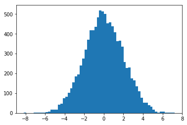
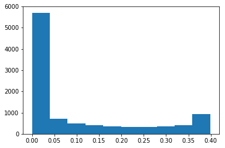

# Skewness and Kurtosis - Lab

## Introduction

In this lab, we shall look at calculating skewness and kurtosis for a given dataset in python and SciPy. 

## Objectives
You will be able to:
* Measure, visualize, and interpret the kurtosis of a dataset
* Measure, visualize, and interpret the skewness of a dataset

## Bring in SciPy
In the previous lesson, we have seen formulas for calculating skewness and kurtosis for a given dataset. Scipy comes packaged with these functions and  provides an easy way to calculate these two quantities, see [scipy.stats.kurtosis](https://docs.scipy.org/doc/scipy/reference/generated/scipy.stats.kurtosis.html#scipy.stats.kurtosis) and [scipy.stats.skew](scipy.stats.skew). Check out the official SciPy documentation for digging deeper into this. Right now we can use format: 
> **scipy.stats.kurtosis(x)**

> **scipy.stats.skew(x)**

Where x is a random continuous variable. 

We shall generate two synthetic datasets and measure/visualize and compare their skew and kurtosis in this lab. So lets get to it.


```python
# Import required libraries
import numpy as np
import matplotlib.pyplot as plt

from scipy.stats import kurtosis, skew
```

## Take 1
Perform following steps
* Generate a random normal variable `x_random` in numpy with 10,000 values. Set the mean value to 0 and standard deviation to 2
* Plot a histogram for data, set bins to `auto` (default). 
* Calculate the skewness and kurtosis for this data distribution using above functions. 
* Record your observations about calculated values and shape of the data. 


```python
x_random = np.random.normal(0, 2, 10000)
print(skew(x_random))
print(kurtosis(x_random))
plt.hist(x_random, bins='auto')
# Skewness = -0.0025781248189666343
# kurtosis = 0.03976806960642154

```

    0.0104712535722946
    -0.05892921054885569


    (array([  2.,   0.,   0.,   0.,   1.,   2.,   1.,   2.,   3.,   5.,   8.,
             17.,  18.,  17.,  42.,  46.,  74.,  81., 103., 125., 155., 185.,
            195., 241., 275., 321., 370., 417., 417., 435., 484., 519., 513.,
            501., 452., 458., 438., 407., 364., 366., 336., 258., 227., 229.,
            175., 164., 134., 111.,  78.,  53.,  53.,  39.,  33.,  18.,   6.,
              3.,   6.,   8.,   3.,   2.,   3.,   1.]),
     array([-8.16230351, -7.91425126, -7.666199  , -7.41814675, -7.17009449,
            -6.92204224, -6.67398999, -6.42593773, -6.17788548, -5.92983322,
            -5.68178097, -5.43372871, -5.18567646, -4.9376242 , -4.68957195,
            -4.4415197 , -4.19346744, -3.94541519, -3.69736293, -3.44931068,
            -3.20125842, -2.95320617, -2.70515392, -2.45710166, -2.20904941,
            -1.96099715, -1.7129449 , -1.46489264, -1.21684039, -0.96878813,
            -0.72073588, -0.47268363, -0.22463137,  0.02342088,  0.27147314,
             0.51952539,  0.76757765,  1.0156299 ,  1.26368215,  1.51173441,
             1.75978666,  2.00783892,  2.25589117,  2.50394343,  2.75199568,
             3.00004793,  3.24810019,  3.49615244,  3.7442047 ,  3.99225695,
             4.24030921,  4.48836146,  4.73641372,  4.98446597,  5.23251822,
             5.48057048,  5.72862273,  5.97667499,  6.22472724,  6.4727795 ,
             6.72083175,  6.968884  ,  7.21693626]),
     <a list of 62 Patch objects>)





#### Your observations here 
* The plot shows that the distribution is normally distributed, this is confirmed by a skew close to zero, though positive, it is always runs between -.5 and .5 (I ran it multiple times).
* kurtosis is also less than 3, usually hovering around 0, meaning that the density curve is mesokurtic. The curve is not too tall and skinny, and not shorter with taller tails, but rather in between like a standard normal distribution.

## Take 2

Let's generate another distribution 


```python
x = np.linspace( -5, 5, 10000 )
y = 1./(np.sqrt(2.*np.pi)) * np.exp( -.5*(x)**2  )  # normal distribution
```

Just like above, perform following steps

* Plot a histogram for data (y), set bins to auto (default).
* Calculate the skewness and kurtosis for this data distribution using above functions.
* Record your observations about calculated values and shape of the data.


```python
print(skew(y))
print(kurtosis(y))
plt.hist(y)

# Skewness = 1.109511549276228
# kurtosis = -0.31039027765889804
```

    1.109511549276228
    -0.31039027765889804


    (array([5708.,  704.,  484.,  396.,  354.,  332.,  332.,  354.,  418.,
             918.]),
     array([1.48671951e-06, 3.98955611e-02, 7.97896355e-02, 1.19683710e-01,
            1.59577784e-01, 1.99471859e-01, 2.39365933e-01, 2.79260007e-01,
            3.19154082e-01, 3.59048156e-01, 3.98942231e-01]),
     <a list of 10 Patch objects>)





```python
print(skew(y))
print(kurtosis(y))
plt.hist(y)
```

    1.109511549276228
    -0.31039027765889804


    (array([5708.,  704.,  484.,  396.,  354.,  332.,  332.,  354.,  418.,
             918.]),
     array([1.48671951e-06, 3.98955611e-02, 7.97896355e-02, 1.19683710e-01,
            1.59577784e-01, 1.99471859e-01, 2.39365933e-01, 2.79260007e-01,
            3.19154082e-01, 3.59048156e-01, 3.98942231e-01]),
     <a list of 10 Patch objects>)


#### Your observations here 
There are only positive values - This distribution is the opposite of a normal gaussian. 

## Level up (Optional)

Use the formulas given in th previous lesson to calculate skewness and kurtosis with numpy only. Compare your results to the ones shown using Scipy. Do you see any differences in the results? Try at least one other method to calculate skewness and compare the results to previous ones. 


```python
def z_skew(Y):
    return np.sum( (Y - Y.mean())**3 / len(Y)) / (Y.std()**3)   
def z_kurtosis(Y):
    return np.sum( (Y - Y.mean())**4 / len(Y)) / (Y.std()**4)  
```


```python
print(z_skew(x_random))
print(z_kurtosis(x_random))
```

    0.010471253572294602
    2.941070789451144


```python
print(z_skew(y))
print(z_kurtosis(y))
```

    1.1095115492762282
    2.6896097223411024


Skew has the same results as scipy but not kurtosis. My formula does still give you the same result if you're comapring the < 3, around 3 or > 3. 

## Summary

In this lesson we learned how to calculate, visualize and analyze the skewness and kurtosis for any given distribution. We worked with synthetic datasets at this stage to get the concepts cleared up. Later we shall try these techniques on real datasets to see if they are fit for analysis (or not). 
